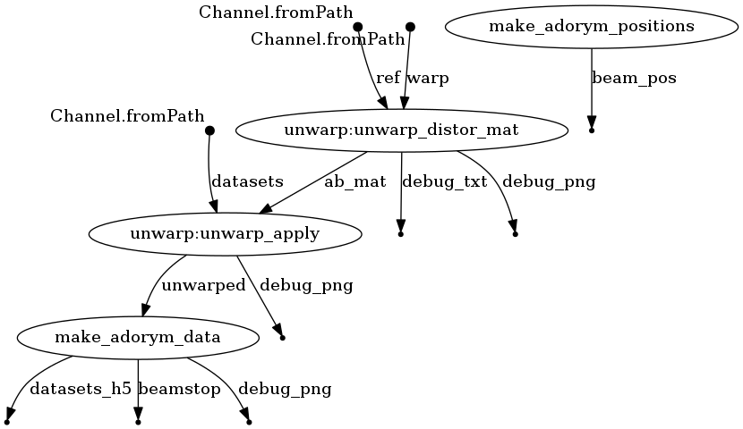

## Nextflow Preprocessing
___
### To run:
```
nextflow run main.nf -resume -params-file config.yaml -name run1 --outputfolder output1 
```
The resume option uses cached results (to mark as dirty, modify the corresponding .nf).
The ```main.nf``` workflow saves it's outputs to a folder called ```output1``` 

Nextflow [Documentation](https://www.nextflow.io/docs/latest/) and [Patterns](https://nextflow-io.github.io/patterns/index.html) (not in DSL 2, but still valuable)
___
### File Structure

├─.nextflow/ - (autogenerated) nextflow internals
├─ data/ - input files
├─ nextflow_modules/ - do not need to change
├─ output/ - (autogen.)
├─ bin/ - scripts - the code that is called
├─ work/ - (autogen.) nextflow's cache, you can look here to get valuable information on how your script run (the 'random' characters)
├─ main.nf - main nextflow workflow
├─ nextflow.config - nextflow execution configurations (how many CPUs/RAM, SLURM, etc.)
├─ config.yaml - yaml file with all configurations
___
### DAG (Directed Acyclic Graph)

### Todo
* Rearrange outputs - ideally the folder structure should look like
        
        ├─ experiment/ - top level directory with data
             ├─ exports/ - top level directory with raw data
             ├─ outputs/ - outputs from nextflow (all of them)
             ├─ nextflow/ - everything that is only nextflow related - no data

* Remove hardcoded parameters in the scripts file out to a parameter file. More generally, clean up scripts. All parameters should be in parameter file, and not in `.py` bin. 
* Turn all `plt.imshow` or `plt.plot` calls into `plt.imsave` or `plt.savefig` files after drawing plot - keep all intermediate output that is small pngs. Is much cheaper to have these once they've been computed than investigating a 25 GB file. 
* Clean up readme/repository information - make it more comprehensive.
___
Python scripts written by Tom Pekin, workflow, parallelisation and modifications of scripts by Pablo Fernández Robledo. Also Wouter Van den Broek with the unwarping code for the Dectris detector

Contact: [tcpekin@gmail.com](mailto:tcpekin@gmail.com) and [robledop@physik.hu-berlin.de](mailto:robledop@physik.hu-berlin.de) or [pablofrldp@gmail.com](mailto:pablofrldp@gmail.com)
